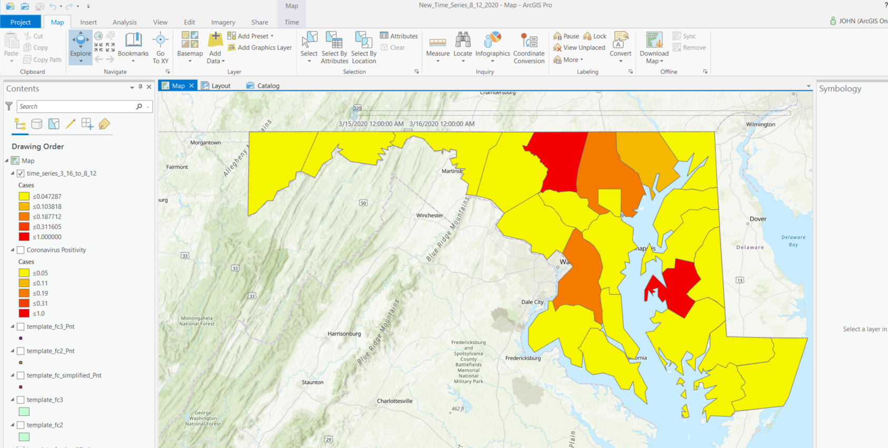

## time_series_fcs/README.md

The quick summary is that this is a Python script for creating multiple feature classes from a template feature class which is then populated by a pandas dataframe that reads an Excel spreadsheet and subsets by date. The features are merged into a single feature class that is set up for time series mapping. With a little bit of work, this can be easily modified/customized to change the field names etc. This was useful for me in creating a time series dataset - johnchurchill-DOIT/time_series_fcs

To recreate the datasets I've created this way, follow these steps.
1. Start with an excel spreadsheet (I downloaded a copy of "Daily Positivity by Jurisdiction" and accessed the tab named "pivot"). The sheet I named here has a date column (Column A) and a column for every county in Maryland (of which there are 23 plus Baltimore City to make a total of 25 columns including date in the first one.). The relevant fields in the template feature class (for my use case) are County, Cases, and Date (naturally these are text, int, and date types). In the spreadsheet, the headers (as described in step 1) are date and the 24 county names (which are also the values). Cases needs to be some numeric value (e.g. number of cases or a percentage).
2. In the User Configuration section of the time_series_merge.py script, point the "data_file" variable to your spreadsheet and edit the "sheet_name" variable if your tab/worksheet has a different name than the one I'm using. 
__NOTE:__ I recommend setting the merge_this to True unless you already have something to start from and just need to add a few more feature classes (to merge manually.)
3. Set the out_ws to a file geodatabase (it can be completely empty as long as the template_fc variable points to a valid template feature class someplace with the required fields).
4. Go into the fclist.py module and add the dates and feature class names to [???ALL THREE???] of these variables for any dates that you wish to include and remove any that you don't plan to include.
5. Run the script (it *__"should"__* all work). Be sure to enable Time and set the settings for the layer properties.
 

 
Image showing time series map.
